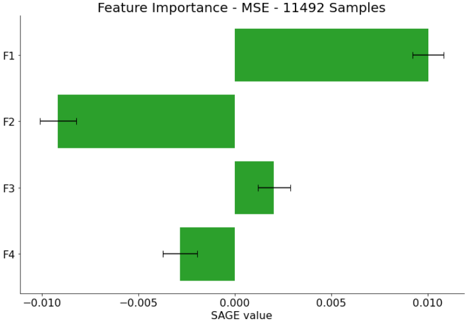
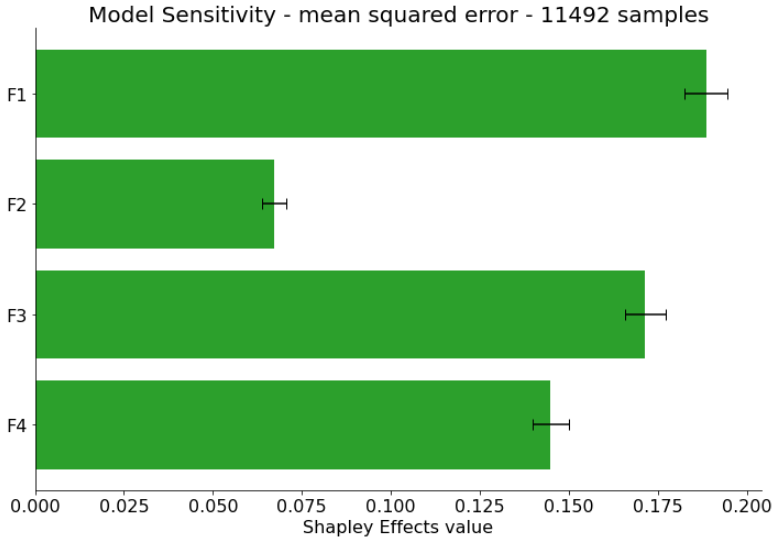

# Explainable AI Assignment 2 - Model Explanations
In this assignment, you are challenged to explain a model. For this, you will research exisiting approaches and apply them to your model and interpret the results.


### Approach #2: SVM Model for Monitoring Reciprocating Compressor Valves with SHAP
Below, the model and its background is briefly explained, followed by a description of the SHAP model explanation approach and the analysis results and a discussion. The code for training the model with given data and applying SHAP to it can be found in *shap_explanation_v02.ipynb*.

#### SVM Model for Monitoring Reciprocating Compressor Valves
The model was built for the PhD-Thesis [Monitoring System for Reciprocating Compressor Valves – A data-driven Approach](https://www.trauner.at/Buchdetail/20190371?kat=216&hauptkat=Universit%C3%A4t) of one of the group members. The purpose of the model is to find cracked or broken valve sealings in reciprocating compressors by analyzing easily available vibration measurements at the valve covers. After the vibration data are transformed to spectrograms by short-time Fourier transformation, 4 features (for simplicity reasons called *F1*, *F2*, *F3*, and *F4*) are extracted from the spectrograms and their autocorrelations and subsequently classified using an SVM. The main advantage of the extracted features and the model is, that the pre-trained model works for different valve types and materials and even for arbitrarily varying compressor loads. Since the main focus of the thesis was on feature engineering, even a comparably simple model like SVM with 4 features was able to distinguish between faultless and broken valves. For further details, the reader is referred to the thesis.


#### SHAP model explanation approach

SHAP (SHapley Additive exPlanations) is a game theoretic approach to explain the output of any machine learning model. It connects optimal credit allocation with local explanations using the classic Shapley values from game theory and their related extensions.
As a unified measure of feature importance, the SHAP values are proposed. These are the Shapley values of a conditional expectation function of the original model. SHAP values provide the unique additive feature importance measure and uses conditional expectations to define simplified inputs. For further details, the reader is referred to [A Unified Approach to Interpreting Model Predictions](https://arxiv.org/pdf/1705.07874.pdf), the [SHAP documentation](https://shap.readthedocs.io/en/latest/#) or the [Python implementation of SHAP on GitHub](https://github.com/slundberg/shap).

##### Questions for SHAP according to Hohmann et al. from our point of view:
1. **WHY** <br> *Interpretability & Explainability:* knowing the feature contributions to the decision helps to interpret and explain why the model makes certain decisions <br> *Debbugging & Improving Models:* identifying features that lead the model in a wrong direction (towards a misclassification) can help to improve the model
2. **WHO** <br> *Model Developers & Builders:* it can help to select meaningful features respectively remove features that don't contribute to correct decisions <br> *Model Users:* it helps to identify which features were mainly contributing to the classifcation of a certain sample, therefore give further insights to the underlying process
3. **WHAT** <br> *Aggregation Information:* the approach identifies the importance of all features for the final classification
4. **HOW** <br> *Instance-based Analysis & Exploration:* for each test instance, the feature importance can be calculated <br> *Algorithms for Attribution & Feature Visualization:* it is computed how the features contribute to the attribution of a test instance
5. **WHEN** <br> *After Training:* The feature importance is done for test samples after training the model
6. **WHERE** <br> [arXiv](https://arxiv.org/pdf/1705.07874.pdf) <br> [GitHub](https://github.com/slundberg/shap)

#### Analysis Results
For training the model and testing the explanation approach, an annotated (*faultless* vs. *cracked/broken*) feature matrix (45970 samples, 4 features) from real world measurements at reciprocating compressors is available in the file *./svm_model_data/xAI_data_2.mat*. This data is split into a training and test set with a splitting ratio of 80 %. The training set is used to train a SVM with a radial basis kernel. After the trained model is feeded to a SHAP Kernel explainer, the SHAP values are computed for the test set. For computational reasons, only 10 % of the test set was used in this analyis.    The figures below show one test sample from class *faultless* (blue) and one test sample from class *cracked/brocken* (red). It shows that the base value of the model output (the average model output over the training set) is 0.9057. In the *faultless* case, all 4 features push the model output towards a lower value (that represents in this model the decision *faultless*). On the other hand, in the *cracked/broken* case, all features push the model output towards a higher value (that represents in this model the decision *cracked/broken*). While in the *faultless* case all features contribute significantly to the decision, the feature *F1* has a realtively small contribution in the *cracked/broken* case. The plots show also the feature values of the analyzed samples (the feature vector were normalized to zero mean and unit standard deviation).


The next figure shows the same quantities as above, however for the whole test set. Therefore, the plots are rotated by 90 degrees, and the 919 samples of the test set are stacked horizontally. Moreover, the samples are ordered by similarity for a better visibility. Again, the *faultless* cases are displayed in blue and the *cracked/broken* cases in red, and the base value of the model output is 0.9057. It can be seen that in the *faultless* case, the importance of all features is quite similar. On the other hand, the feature importance in the *cracked/broken* case are varying significantly. For some samples, feature *F1* contributes almost the whole importance (for instance sample 20 to 50), while for other samples it has a relatively small importance (for instance sample 520 to 660). 


Finally, the average impact on model output magnitude is depicted in the following figure. It shows that, on average over the whole test set, feature *F1* has the highest impact on the model output, followed by *F3*, *F4*, and *F2*.


#### Discussion  
The most interesting insights to the model can be given by the horizontally stacked feature importance plot, especially for the *cracked/broken* case. First of all, it shows the dominance of feature *F1* for some samples. Even though the exact information for each sample is not available in the present data set, it can be concluded from system and feature engineering knowledge that these samples represent the cases of constant compressor load. For constant compressor load, feature *F1* was sufficient to distinguish between the cases *faultless* and *cracked/broken*. To enable fault detection even for varying compressor loads, feature *F2* was added in a later step of feature engineering after acquiring additional measurement data. The samples with varying load are therefore most probably represented in the plot by higher importance of *F2*. However, even with feature *F2*, fault detection was sometimes still difficult for less severe faults (small cracks in the sealing). For those cases, features *F3* and *F4* were developed and added to the model. These two features are also sensitive to small faults in the valves. It can be assumed that this is the case for samples 330 to 450 of the test set. Furthemore, the severity of a fault could correlate to the absolute output magnitude, however this would need further investigations with a data set that contains fault severity information.

All conclusions above were drawn for the *cracked/broken*. For the *faultless* class, all features contribute more or less equally to a decision.

From the findings above, the model could be improved in a way that it gives a more specific output than *faultless* or *cracked/broken*. It could give information about the load (constant or varying) and the severity of the fault. However, all of this has to be proven with data that contain all the needed information.

The results of the SHAP model explanation analysis suggest also that the feature engineering was successful, since all classification results are very distinct. Furthermore, for each of the analyzed test samples, every feature pushes the model output in the same direction, suggesting very consistent outputs of the monotoring systems.


### Approach #3: SAGE

  Approach 3 also uses the SVM model for detecting faulty compressor valves.
  Selecting also SAGE for this model seemed like a very interesting idea, since we already had SHAPE.
  Seeing the difference between these 2 approaches is very interesting.

* Breifly summarize the approach. 

  SAGE (Shapley Additive Global importancE) is a game-theoretic approach for understanding black-box machine learning models. It summarizes each feature's importance based on the predictive power it contributes, and it accounts for complex feature interactions using the Shapley value.
  [The paper that introduced SAGE.](https://arxiv.org/abs/2004.00668)

  SAGE is very simmilar to SHAPE.
  To be precise SAGE is a variation of SHAPE.
  The key difference being that SAGE computes a global feature importance.
  Given no labels the SAGE approach computes the model sensitivity.
  
  SAGE assigns each feature a value that represent how much the feature contributes to models performance.
  The most important features have the highest values.
  SHAPE uses an individual example of input data and the model. Given these 2 things it can compute the importance of each feature for the decision.
  SAGE uses an entire dataset and computes the global feature importance. This creates a more general view on the model over a range of data inputs. When using sage this is important to keep in mind. The result depends on the data handed to it.
  
  A very good picture showing the difference between these 2 approaches is available on this [website](https://iancovert.com/blog/understanding-shap-sage/):

  
  
  Both of them build on the Shapley values.

* Categorize this explainability approach according to the criteria by Hohman et al.

##### Questions for SAGE according to Hohmann et al. from our point of view:
1. **WHY**
 *Debbugging & Improving Models:* identifying features that do not contribute to the solution and thus can be dropped and make the model less complex.
 *Interpretability & Explainability:* finding out which feature contributes how much to the decisions gives a very good insight in the models general function.
2. **WHO**
  *Model Developers & Builders:* the approach can support feature engineering and selection.
  *Model Users:* the approach gives better understanding in how generally the decisions rely on the features.
3. **WHAT**
  *Aggregation Information:* the contribution of each feature to the models decisions (globally) is obtained.
4. **HOW**
  *Instance-based Analysis & Exploration:* for a given test dataset the global feature importance or the model sensitivity can be calculated.
  *Algorithms for Attribution & Feature Visualization:* for the entirety of the given evaluation dataset a global value for each feature is calculated that reflects how much the feature contributes to the model's performance.
5. **WHEN**
  *After Training:* The "global" feature importance or the model sensitivity is computed after the training process on an input data set --> (parts of) the training folds or sets.
  
6. **WHERE**
  [arXiv](https://arxiv.org/abs/2004.00668) this is the main paper, but there are some more with variation and improvement approaches.
  [GitHub](https://github.com/iancovert/sage) including the examples where it has been applied.

* Interpret the results here. How does it help to explain your model?

  For applying the approach a couple of things are necessary.
  First the SAGE package from [GitHub](https://github.com/iancovert/sage).
  The approach is mdoel agnostic and thus is able to handle all kinds of models.
  
  The package offer the option of 2 loss functions (MeanSquredError, Cross Entropy).
  For our approach the best readability was provided by the Cross Entropy.
  The [imputor](https://en.wikipedia.org/wiki/Imputation_(statistics)) replaces the missing values that occur with feature permutation with a value. There is the option of using marginal distribution to calculate replacements.
  Since this was a pretty new topic to me and the calculations in this regard take forever anyways, i chose to go with zero imputation.
  This means replacing it with a default value of zero. To my knowledge this is enough for our model and the approach.
  The next step is to create a estimator of the SAGE values.
  We used the permutation esitmator, which has the slowest convergence but is the easiest to understand.
  For convergence we experimented with different size of inputs. Around 100 values there is no relevant change in the SAGE values. Even a test on the full dataset did not change that.
  The code for such a run looks like this:
  
    ```python
        imputer = sage.DefaultImputer(my_model, np.zeros(4)) #zeros for zero imputation
        estimator = sage.PermutationEstimator(imputer, 'cross entropy') #using CE as loss func
        sage_values = estimator(X_test, y_test) #esitmate on the entire test fold
    ```
    
  The result values are dumped with pickle in the sage folder.
  
  **Interpretation:**
  Disclaimer: The Model was developed and trained by the teammeber who mostly worked on the SHAP approach.
  Thus this analysis and discussion will not be as insightfull since my/our knowledge of it is limited.
  
  The result is expected to very similar to the SHAPE result.
  The average impact on the model showed in the SHAPE result should be relatively the same.
  
  The plots for the feature importance:
  The experiments with different loss functions and different amount of samples lead to the following results.
  
  
  
  
  
  The plots show each run of the SAGE approach.
  What we can observe is:
  - The Values seem to converge around 100 values. After that they do not change a lot.
  - Feature 2 has the least significance for the decisions.
  - Depending on the method Feature 1 set iteslf apart at the top.
  - So Feature 1 seems to be the most relevant for decisions.
  - In the same sense FEature 2 seems the least relevant.
  - Feature 3 and 4 seem similarly important.
  - When using more samples (closer to convergance) 3 and 4 lose importance.
  - When using mean square error negative values for F2 and F4 occur. When reading the paper I unfortunately could not find out what this could mean.
  
  Problems and further ideas:
  - I could not find out why the values are negative with MSE and what it could mean.
  - F2 seems to be of less importance. To get a lot better insights one could train the model again without it and see how the behaviour changes.
  - The package offers 2 loss functions, to my knowledge there is no clear "better" one of them. Depending on the model and data each of them would lead to different results and different insights.
  - Zero imputation was the easiest to understand and perfrom, but propably there are ways that yield mor accurate and better insights.
  - The SAGE approach does not alow to see how each feature contributes to each class. The SHAP approach allows for this.
  
  The plots for the model sensitivity for all samples of the test fold with each loss function:
  
  
  
  "A sensitivity analysis determines how different values of an independent variable affect a particular dependent variable under a given set of assumptions. In other words, sensitivity analyses study how various sources of uncertainty in a mathematical model contribute to the model's overall uncertainty." - Wikipedia's short defeinition of model sensitivity analysis.
  
  This is actually not SAGE more an addition or part of SAGE.
  Actually this are the Shapley Effects (investigates the contribution of each input parameter as well as its interactions with every other parameter in the system by exploring all possible permutations between them)
  Which is very similar to SAGE in its nature.
  So we can also observe really similar results.
  
  What does this tell us:
  - Both graphs look very similar in its shape.
  - F2 is less present with cross entropy
  - Cross entropy bring more difference between F3 or F4 and F1.
  - In general very similar to the rest of the results.
  
 
 **Conclusion and Comparison to SHAP:**
 - The features seem well engineered and selected for the purpose.
 - The global importance of the features is dominated by F1 and followed by F3 and F4.
 - F2 seems globally less of importance to most of the decisions.
 - SHAP shows very similar results --> F2 less, F1,3,4 are most important. F1 dominates.
 - Not as detailed or as much insight as SHAP but it would offer a lot more possibilites if the time would be invested.
  
  

### Approach #4: LIME
***LIME - Local Interpretable Model-Agnostic Explanations:***

Local Interpretable Model-agnostic Explanations (LIME) is an interpretable method proposed by scholars at the 2016 KDD conference [(Ribeiro et al., 2016)](https://arxiv.org/abs/1602.04938). Local pointed out that this method is a partially interpretable method, that is, used to explain the reason for the prediction of a specific sample. Model-agnostic indicates that this method has nothing to do with the type of model, and treats any machine learning model as a black box. Because the algorithm is intuitive and the effect is obvious, LIME is currently widely used in various scenarios. 
The core idea of LIME is very simple, The workflow for obtaining interpretable results of a sample can be intuitively described as: 
  - First, the sample is expressed in a way that humans can understand, such as dividing the text into words and dividing the image into super pixel blocks;
  - Sampling around the sample representation, such as removing some words in the text word list, shielding some super pixel blocks of the image;
  - Use the original model to predict these samples, and train a linear model to approximate the original model near the original sample.
  
 

***Questions for LIME according to Hohmann et al. from our point of view:***
1. **WHY**
  - Interpretability & Explainability: of course
  - Debbugging & Improving Models: Can be used to optimize model and feature design
  - Comparing & Selecting Models：Need to compare manually
  - Education: Very suitable for non-experts to explain how image and text classifiers work
2. **WHO**
  - Model Developers & Builders: Can be used to optimize model and feature design
  - Model Users: It can give a more intuitive understanding of how the results are generated, thereby making a choice between the model or the dataset more reasonable.
  - Non-experts：For educational purpose. It is very interesting to analyze the image classifier with it.
3. **WHAT**
  - Aggregation Information.
4. **HOW**
  - Instance-based Analysis & Exploration: Perform local linear approximation on a single sample
  - Algorithms for Attribution & Feature Visualization: Understand the contribution of each feature to the model decision by analyzing a single sample.
5. **WHEN**
  - After Training.
6. **WHERE**
  - [arXiv](https://arxiv.org/abs/1602.04938)
  - [GitHub](https://github.com/marcotcr/lime)

***Tests and results:***

I used the exact same model and training data as Mr. Pichler. LIME is very suitable for explaining models with intuitive input, such as pictures, text, and technical parameters. However, because the model and input data used here are not very intuitive, it is relatively difficult to use LIME to explain. Therefore, I first used LIME to generate several explainers (that is, randomly collected a corresponding number of samples), and based on observations, selected two sets of typical results from them, and selected one sample from each for local analysis.

The following figure shows one typical case, which predicted class_0.

 
 
It can be seen from the figure that F1 has a stronger influence on the prediction results. Next, I performed a simple local linear approximation analysis.

 
 
The values of F1 and F4 (the weight of F4 is also relatively high) are modified, and the results meet the expectations. The slight disturbance of F1 and F4 alone will interfere with the predicted probability to some extent. And their disturbances combined will completely change the prediction results.
The following two figures show the effect of changes in F1 and F4 (respectively) on the predicted probability.

 
 

 Next we look at another situation which predicted class_1.
 
  
  
 As can be seen from the picture, the four features have similar effects on the results. We expect that for the prediction of class_1, no feature has a dominant influence, but should be the result of the interaction of the four features. Next let us see the result of local linear approximation.
 
  
  
It can be seen that the results are in line with expectations. We can look at the influence of F1 and F4 on the predicted class_1 again. From the figure, we can see that their individual changes have no effect on the result.

 
 
   
***Conclusion:***

In general, the results of the test basically met expectations. However, since only two typical cases were selected, many details were not analyzed. LIME is more suitable for explaining more intuitive models, such as pictures and texts. Splitting and sampling them is easier for people to understand. The models and data used in this assignment are difficult for non-experts to understand. For such models, LIME can be used as an expert analysis/debug tool to improve the model and feature design.


## Table criteria by Hohman et al.

    .---------------------------------------------------------------------------------------------------.              
    |                                            |    SHAP     |   SAGE     | AlphafoldV1 |   LIME      |
    |                                            |             |            |             |             |
    |--------------------------------------------+-------------+------------+-------------+-------------| 
    |        | Interpretability & Explainability |       X     |      X     |       X     |     X       |
    |        |-----------------------------------|-------------|------------|-------------|-------------|
    |   Why  | Debugging & Improving Models      |       X     |      X     |             |     X       |
    |        |-----------------------------------|-------------|------------|-------------|-------------|
    |        | Comparing & Selecting Models      |             |            |             |     X       |
    |        |-----------------------------------|-------------|------------|-------------|-------------|
    |        | Education                         |             |            |       X     |     X       |
    |--------+-----------------------------------|-------------|------------|-------------|-------------|
    |        | Model Developers & Builders       |       X     |      X     |             |     X       |
    |        |-----------------------------------|-------------|------------|-------------|-------------|
    |  Who   | Model Users                       |       X     |      X     |       X     |     X       |
    |        |-----------------------------------|-------------|------------|-------------|-------------|
    |        | Non-experts                       |             |            |       X     |     X       |
    |--------+-----------------------------------|-------------|------------|-------------|-------------|
    |        | Computational Graph               |             |            |       X     |             |
    |        | & Network Architecture            |             |            |             |             |
    |        |-----------------------------------|-------------|------------|-------------|-------------|
    |        | Learned Model Parameters          |             |            |       X     |             |
    |  What  |-----------------------------------|-------------|------------|-------------|-------------|
    |        | Individual Computational Units    |             |            |             |             |
    |        |-----------------------------------|-------------|------------|-------------|-------------|
    |        | Neurons in High-dimensional Space |             |            |             |             |
    |        |-----------------------------------|-------------|------------|-------------|-------------|
    |        | Aggregated Information            |       X     |      X     |       X     |     X       |
    |--------+-----------------------------------|-------------|------------|-------------|-------------|
    |        | Node-link Diagrams                |             |            |             |             |
    |        | for Network Architecture          |             |            |             |             |
    |        |-----------------------------------|-------------|------------|-------------|-------------|
    |        | Dimensionality Reduction          |             |            |             |             |
    |        | & Scatter Plots                   |             |            |             |             |
    |        |-----------------------------------|-------------|------------|-------------|-------------|
    |        | Line Charts for Temporal Metrics  |             |            |             |             |
    |  How   |-----------------------------------|-------------|------------|-------------|-------------|
    |        | Instance-based Analysis           |       X     |      X     |             |     X       |
    |        | & Exploration                     |             |            |             |             |
    |        |-----------------------------------|-------------|------------|-------------|-------------|
    |        | Interactive Experimentation       |             |            |      X      |             |
    |        |-----------------------------------|-------------|------------|-------------|-------------|
    |        | Algorithms for Attribution        |       X     |            |             |     X       |
    |        | & Feature Visualization           |             |            |             |             |
    |--------+-----------------------------------|-------------|------------|-------------|-------------|
    |        | During Training                   |             |            |             |             |
    |  When  |-----------------------------------|-------------|------------|-------------|-------------|
    |        | After Training                    |       X     |     X      |       X     |     X       |
    |--------+-----------------------------------|-------------|------------|-------------|-------------|
    |  Where | Publication Venue                 |             |            |             |             |
    '---------------------------------------------------------------------------------------------------'
                


