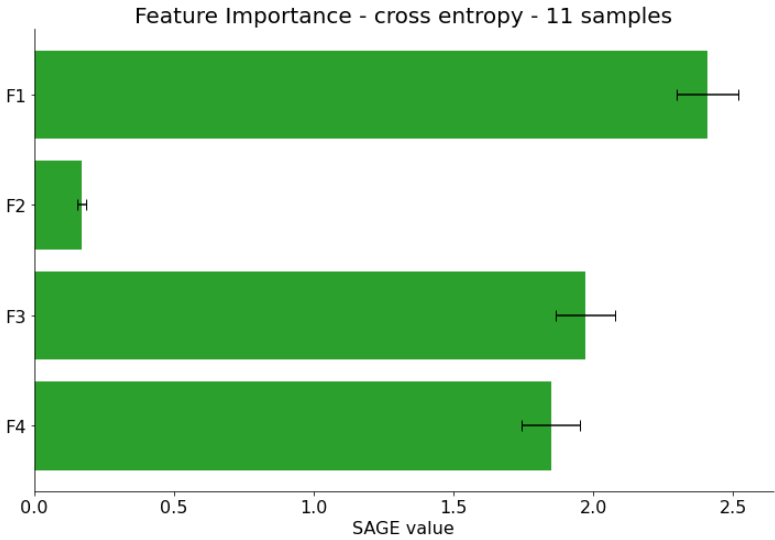

## Report

### Model & Data

* Which model are you going to explain? What does it do? On which data is it used?
* From where did you get the model and the data used?
* Describe the model.

### Explainability Approaches
Find explainability approaches for the selected models. Repeat the section below for each approach to describe it.

#### Approach #3

  Approach 3 also uses the SVM model for detecting faulty compressor valves.
  Selecting also SAGE for this model seemed like a very interesting idea, since we already had SHAPE.
  Seeing the difference between these 2 approaches is very interesting.

* Breifly summarize the approach. 

  SAGE (Shapley Additive Global importancE) is a game-theoretic approach for understanding black-box machine learning models. It summarizes each feature's importance based on the predictive power it contributes, and it accounts for complex feature interactions using the Shapley value.
  [The paper that introduced SAGE.](https://arxiv.org/abs/2004.00668)

  SAGE is very simmilar to SHAPE.
  To be precise SAGE is a variation of SHAPE.
  The key difference being that SAGE computes a global feature importance.
  Given no labels the SAGE approach computes the model sensitivity.
  
  SAGE assigns each feature a value that represent how much the feature contributes to models performance.
  The most important features have the highest values.
  SHAPE uses an individual example of input data and the model. Given these 2 things it can compute the importance of each feature for the decision.
  SAGE uses an entire dataset and computes the global feature importance. This creates a more general view on the model over a range of data inputs. When using sage this is important to keep in mind. The result depends on the data handed to it.
  
  A very good picture showing the difference between these 2 approaches is available on this [website](https://iancovert.com/blog/understanding-shap-sage/):
  
  
  
  Both of them build on the Shapley values.

* Categorize this explainability approach according to the criteria by Hohman et al.

##### Questions for SAGE according to Hohmann et al. from our point of view:
1. **WHY**
 *Debbugging & Improving Models:* identifying features that do not contribute to the solution and thus can be dropped and make the model less complex.
 *Interpretability & Explainability:* finding out which feature contributes how much to the decisions gives a very good insight in the models general function.
2. **WHO**
  *Model Developers & Builders:* the approach can support feature engineering and selection.
  *Model Users:* the approach gives better understanding in how generally the decisions rely on the features.
3. **WHAT**
  *Aggregation Information:* the contribution of each feature to the models decisions (globally) is obtained.
4. **HOW**
  *Instance-based Analysis & Exploration:* for a given test dataset the global feature importance or the model sensitivity can be calculated.
  *Algorithms for Attribution & Feature Visualization:* for the entirety of the given evaluation dataset a global value for each feature is calculated that reflects how much the feature contributes to the model's performance.
5. **WHEN**
  *After Training:* The "global" feature importance or the model sensitivity is computed after the training process on an input data set --> (parts of) the training folds or sets.
  
6. **WHERE**
  [arXiv](https://arxiv.org/abs/2004.00668) this is the main paper, but there are some more with variation and improvement approaches.
  [GitHub](https://github.com/iancovert/sage) including the examples where it has been applied.

* Interpret the results here. How does it help to explain your model?

  For applying the approach a couple of things are necessary.
  First the SAGE package from [GitHub](https://github.com/iancovert/sage).
  The approach is mdoel agnostic and thus is able to handle all kinds of models.
  
  The package offer the option of 2 loss functions (MeanSquredError, Cross Entropy).
  For our approach the best readability was provided by the Cross Entropy.
  The [imputor](https://en.wikipedia.org/wiki/Imputation_(statistics)) replaces the missing values that occur with feature permutation with a value. There is the option of using marginal distribution to calculate replacements.
  Since this was a pretty new topic to me and the calculations in this regard take forever anyways, i chose to go with zero imputation.
  This means replacing it with a default value of zero. To my knowledge this is enough for our model and the approach.
  The next step is to create a estimator of the SAGE values.
  We used the permutation esitmator, which has the slowest convergence but is the easiest to understand.
  For convergence we experimented with different size of inputs. Around 100 values there is no relevant change in the SAGE values. Even a test on the full dataset did not change that.
  The code for such a run looks like this:
  
    ```python
        imputer = sage.DefaultImputer(my_model, np.zeros(4)) #zeros for zero imputation
        estimator = sage.PermutationEstimator(imputer, 'cross entropy') #using CE as loss func
        sage_values = estimator(X_test, y_test) #esitmate on the entire test fold
    ```
    
  The result values are dumped with pickle in the sage folder.
  
  **Interpretation:**
  Disclaimer: The Model was developed and trained by the teammeber who mostly worked on the SHAP approach.
  Thus this analysis and discussion will not be as insightfull since my/our knowledge of it is limited.
  
  The result is expected to very similar to the SHAPE result.
  The average impact on the model showed in the SHAPE result should be relatively the same.
  
  The plots for the feature importance:
  The experiments with different loss functions and different amount of samples lead to the following results.
  
  
  
  
  
  The plots show each run of the SAGE approach.
  What we can observe is:
  - The Values seem to converge around 100 values. After that they do not change a lot.
  - Feature 2 has the least significance for the decisions.
  - Depending on the method Feature 1 set iteslf apart at the top.
  - So Feature 1 seems to be the most relevant for decisions.
  - In the same sense FEature 2 seems the least relevant.
  - Feature 3 and 4 seem similarly important.
  - When using more samples (closer to convergance) 3 and 4 lose importance.
  - When using mean square error negative values for F2 and F4 occur. When reading the paper I unfortunately could not find out what this could mean.
  
  Problems and further ideas:
  - I could not find out why the values are negative with MSE and what it could mean.
  - F2 seems to be of less importance. To get a lot better insights one could train the model again without it and see how the behaviour changes.
  - The package offers 2 loss functions, to my knowledge there is no clear "better" one of them. Depending on the model and data each of them would lead to different results and different insights.
  - Zero imputation was the easiest to understand and perfrom, but propably there are ways that yield mor accurate and better insights.
  - The SAGE approach does not alow to see how each feature contributes to each class. The SHAP approach allows for this.
  
  The plots for the model sensitivity for all samples of the test fold with each loss function:
  
  
  
  "A sensitivity analysis determines how different values of an independent variable affect a particular dependent variable under a given set of assumptions. In other words, sensitivity analyses study how various sources of uncertainty in a mathematical model contribute to the model's overall uncertainty." - Wikipedia's short defeinition of model sensitivity analysis.
  
  This is actually not SAGE more an addition or part of SAGE.
  Actually this are the Shapley Effects (investigates the contribution of each input parameter as well as its interactions with every other parameter in the system by exploring all possible permutations between them)
  Which is very similar to SAGE in its nature.
  So we can also observe really similar results.
  
  What does this tell us:
  - Both graphs look very similar in its shape.
  - F2 is less present with cross entropy
  - Cross entropy bring more difference between F3 or F4 and F1.
  - In general very similar to the rest of the results.
  
 
 **Conclusion and Comparison to SHAP:**
 - The features seem well engineered and selected for the purpose.
 - The global importance of the features is dominated by F1 and followed by F3 and F4.
 - F2 seems globally less of importance to most of the decisions.
 - SHAP shows very similar results --> F2 less, F1,3,4 are most important. F1 dominates.
 - Not as detailed or as much insight as SHAP but it would offer a lot more possibilites if the time would be invested.
  
  
